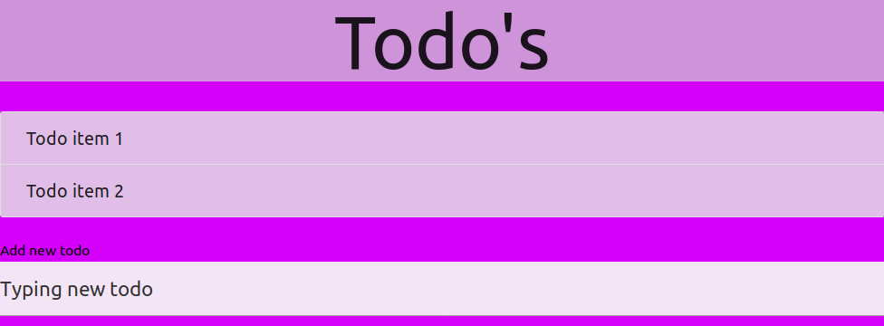

# Todo App

A simple todo App built with React. This project is part of the Netninja React and Redux tutorial available [here](https://www.youtube.com/playlist?list=PL4cUxeGkcC9ij8CfkAY2RAGb-tmkNwQHG)

## Usage
- To add todo item, type in the field below the "add new todo" label and hit enter.

- To delete todo item, click on the todo text.

## Requirements
- Node.js

## How to run
- Clone this repository and `cd` into the project folder.
- Run `npm install`
- Run `npm start` 
- If all goes well, App will open in your browser.

## Contributor
- [Moses Ogwo](https://github.com/mosesogwo/)

